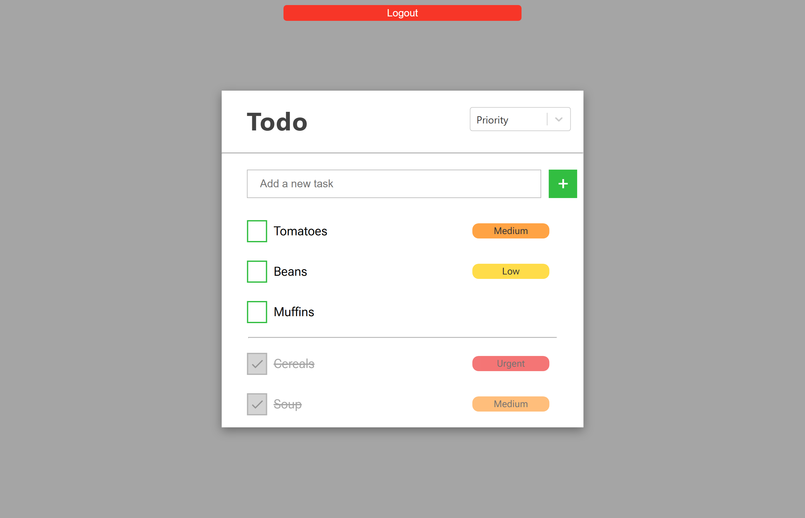
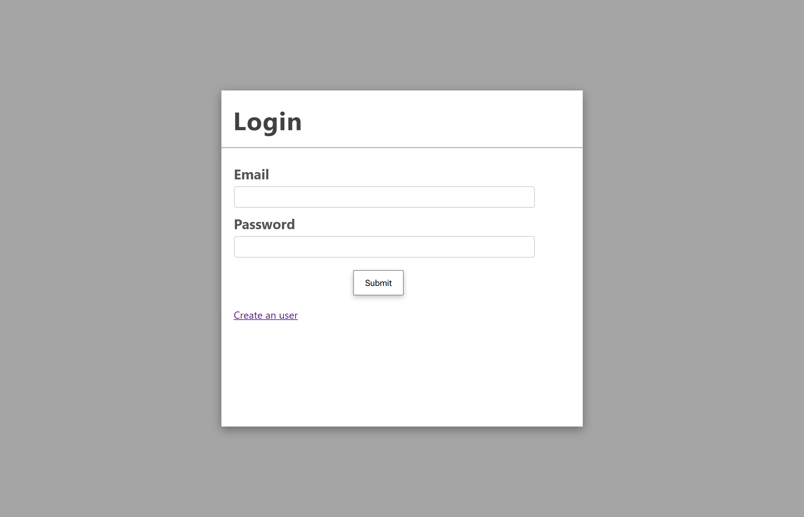
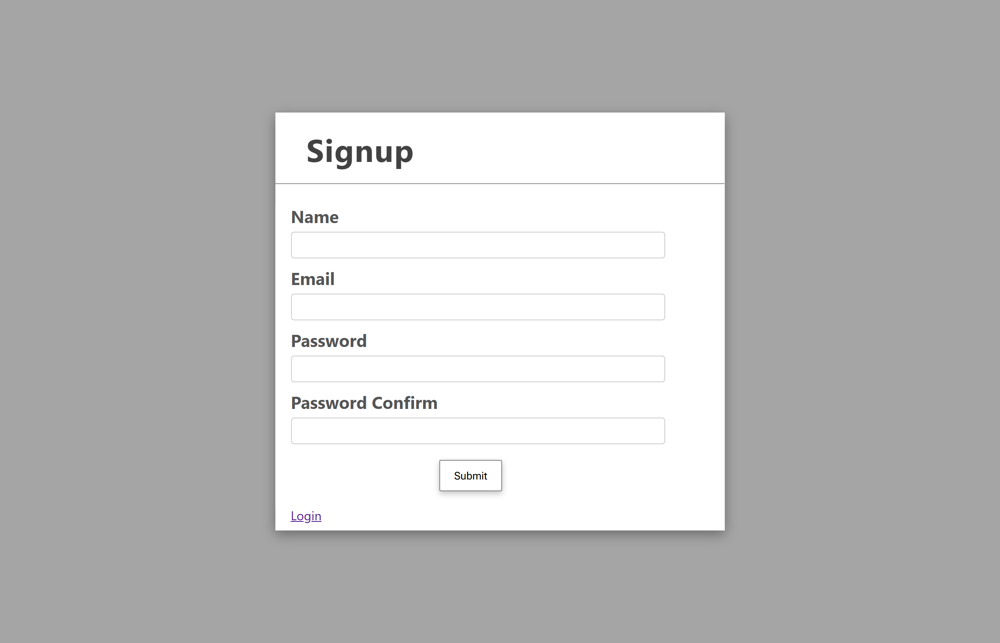

# Todo App - MERN Stack

## Project Description

This **Todo App** is a full-stack web application built with the MERN stack (MongoDB, Express.js, React, and Node.js) that allows users to efficiently manage their daily tasks. 

## Technologies Used
- Frontend
  - React: JavaScript library for building the user interface.

  - React Router: Routing management

  - Vite: Build tool.

- Backend
  - Node.js: JavaScript runtime for the server.

  - Express.js: Framework for building web applications and APIs.

  - MongoDB: NoSQL database for storing data.

  - Mongoose: ODM (Object Data Modeling) for MongoDB and Node.js.

  - JWT: Token-based authentication for security.

- Development Tools
  - Git: Version control.

  - Postman: API testing.

  - ESLint: Linter for maintaining clean and consistent code.

  - Prettier: Code formatter.

## UI

### Todos List

### Login

### Signup



## Installation and Setup

Follow these steps to set up and run the project on your local machine.

### Prerequisites

- **Node.js** (v16 or higher)
- **npm** or **yarn** (package managers)
- **MongoDB** (local or cloud-based, such as MongoDB Atlas)

### Installation Steps

1. **Clone the Repository**

  ```bash
  git clone https://github.com/DiegooCM/Todo-app-MERN.git
  cd todo-app-mern
  ```

2. **Install Backend Dependencies**

  ```bash
  cd server
  npm install
  ```

3. **Configure Environment Variables**

  Create a `.env` file in the `server` folder and configure the following variables:

  ```env
  NODE_ENV=development
  PORT=3000
  DATABASE_LOCAL=mongodb://127.0.0.1:27017/todo-app

  USER=user
  PASSWORD=abcdefg

  JWT_SECRET=super-secret-password
  JWT_EXPIRES_IN=90d
  JWT_COOKIE_EXPIRES_IN=90
   ```

4. **Install Frontend Dependencies**

  ```bash
  cd ../client
  npm install
  ```

5. **Run the Project**

  - **Backend**:

    ```bash
    cd ../backend
    npm start
    ```

  - **Frontend**:

    ```bash
    cd ../frontend
    npm run dev
    ```

6. **Access the Application**

   Open your browser and visit `http://localhost:3000` to see the application in action.

## Features

- [x] Crud for Todos
- [x] Mark as completed the Todos
- [x] Minimal Error Handling
- [x] Modal for editing Todos and adding a description and a priority type
- [x] Sort By (none, date, or priority)
- [x] Auth
  - [x] Login 
  - [x] Signup
  - [x] JWT

- [ ] Upgrade login and signup pages
- [ ] Be able to change user info (email, name, password,...)
- [ ] Be able to move position of todos
- [ ] Animations

## Contributing

I would be very happy if someone contributed to this project, whether it's to fix a bug, correct an error, or add a new feature. Every contribution, no matter how small, is greatly appreciated!

If you'd like to contribute, please follow these steps:

1. Fork the repository.

2. Create a branch for your feature (git checkout -b feature/new-feature).

3. Make your changes and commit them (git commit -m 'Add new feature').

4. Push to the branch (git push origin feature/new-feature).

5. Open a Pull Request.

---

Thank you for visiting this project! I hope you find it useful.